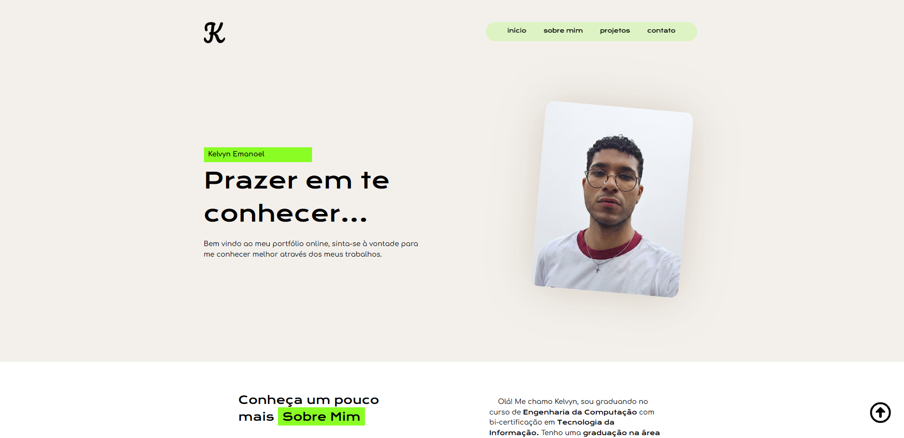

# Site Portfólio - Kelvyn Emanoel

Este repositório contém o código-fonte do meu site portfólio pessoal, desenvolvido para apresentar minha trajetória profissional, competências técnicas e projetos realizados nas áreas de Design e Tecnologia da Informação.

## 📝 Sobre o Projeto
O projeto consiste em um site estático moderno que serve como cartão de visitas digital. Ele foi estruturado para destacar minhas habilidades em desenvolvimento web e design visual, proporcionando uma navegação intuitiva e uma apresentação clara das minhas redes profissionais. A arquitetura do código foca na semântica do HTML5 e na organização modular do CSS, refletindo um perfil que une técnica e estética.

## 🎯 Objetivos
* **Documentação:** Registrar o processo de criação e evolução técnica do site.
* **Apresentação Profissional:** Exibir de forma organizada os projetos e experiências, como a atuação em TI e o background em Design.
* **User Experience (UX):** Aplicar conceitos fundamentais de interface de usuário para garantir que o visitante encontre informações de contato e biografia com facilidade.
* **Prática Técnica:** Consolidar conhecimentos em estilização avançada, manipulação de fontes externas e integração de ícones.

## 🚀 Tecnologias Utilizadas
O projeto foi construído utilizando as seguintes tecnologias e recursos:
* **HTML5:** Estruturação semântica do conteúdo.
* **CSS3:** Estilização personalizada, incluindo o uso de variáveis CSS (`:root`) para cores e tipografia.
* **Google Fonts:** Integração das fontes *Krona One* para títulos e *Comfortaa* para o corpo do texto.
* **Font Awesome:** Biblioteca de ícones para representação visual de redes sociais e contatos.
* **Figma:** Utilizado para a criação do [Wireframe](https://www.figma.com/proto/hOh6eUIoCiZ0Xc5pMvb8IN/Portif%C3%B3lio-Kelvyn-Emanoel?node-id=1-4&p=f&t=EVRNTGu4Vd2RC9Ka-1&scaling=scale-down&content-scaling=fixed&page-id=0%3A1&starting-point-node-id=1%3A4) e planejamento de UI.

## 📱 Responsividade
A responsividade é um pilar central deste projeto. O site foi desenvolvido com foco na adaptação para diferentes dispositivos, garantindo que:
* O layout se ajuste dinamicamente a partir de resoluções de smartphone (360px).
* Utilize `@media queries` para reorganizar elementos como o menu de navegação e as seções de conteúdo em telas maiores.
* A legibilidade e os elementos visuais (como o efeito de Glassmorphism e o layout flexível) sejam preservados em qualquer tamanho de tela.

## 🖼️ Preview

## Acesse o projeto

[Kelvyn Emanoel | Portfólio](https://kelvynemanoel.github.io/siteportifolio/)

---
Desenvolvido por **Kelvyn Emanoel**
